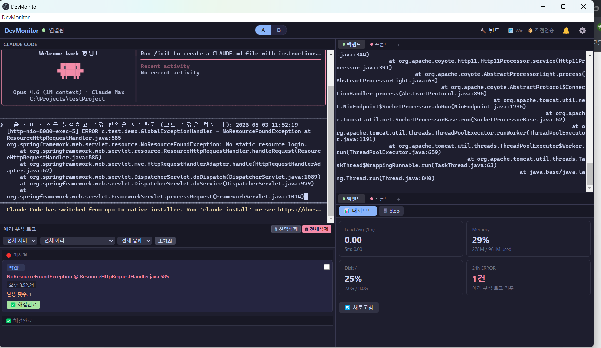
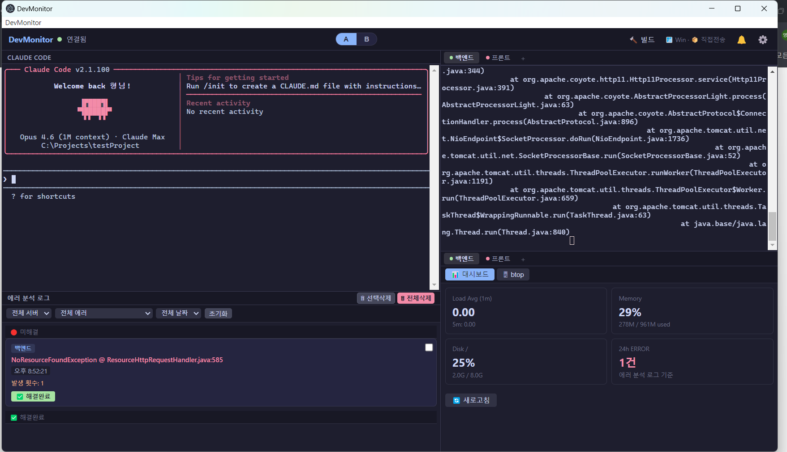
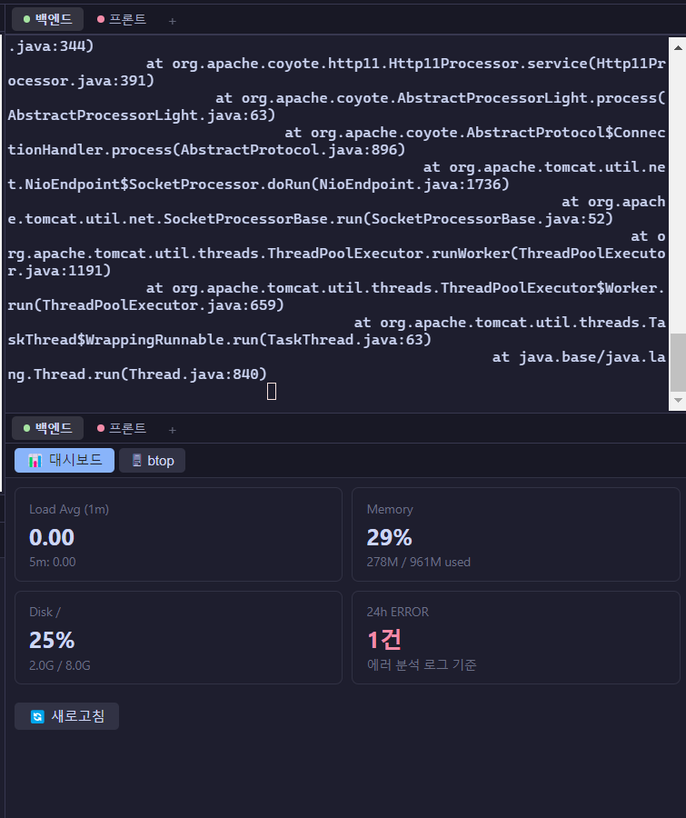
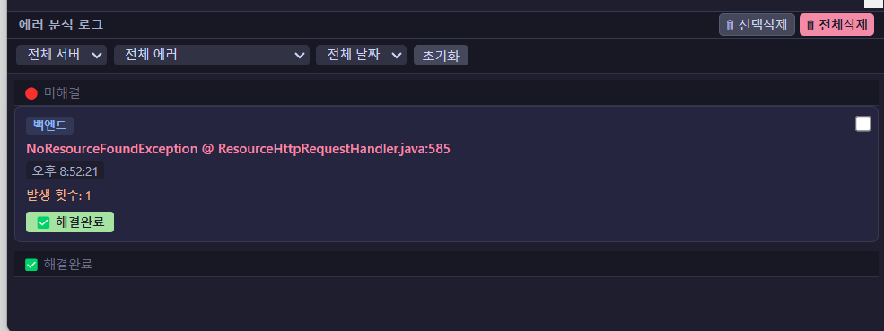
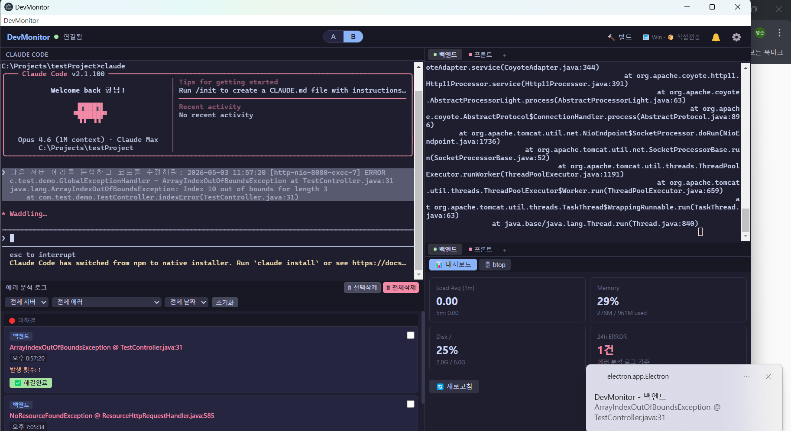
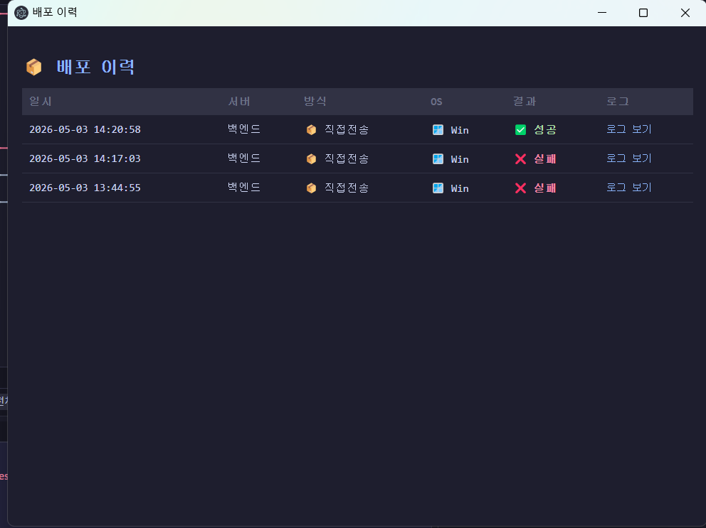
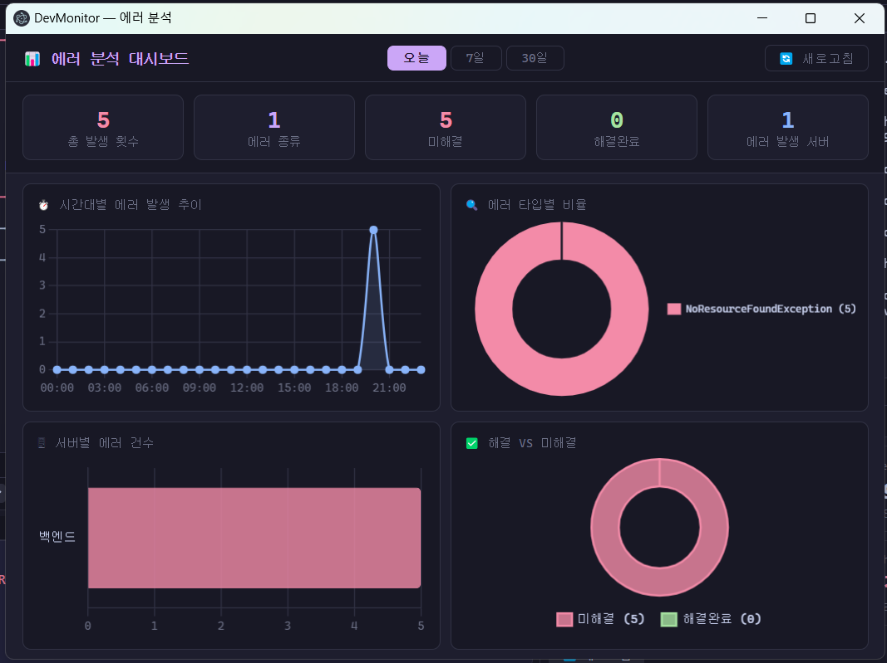
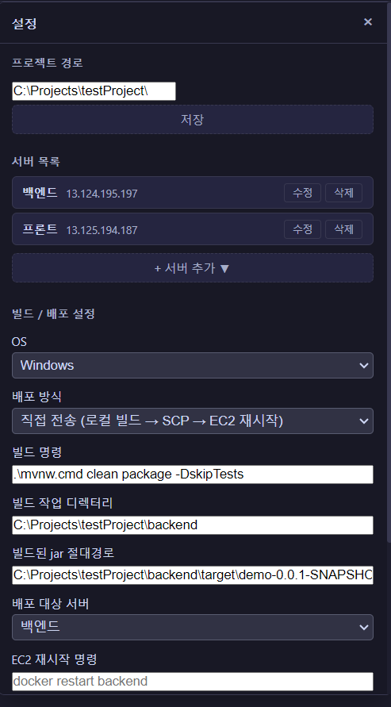
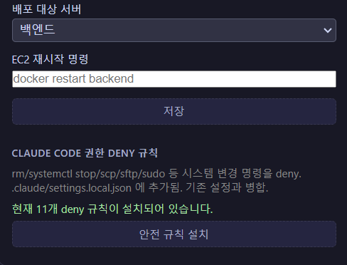

# DevMonitor

AWS EC2 서버의 에러 로그를 실시간으로 감지하고, Claude Code AI에게 자동으로 전달하는 운영 모니터링 도구.

에러 수정 권한은 운영자에게 있다. AI는 분석만 한다.


---

## 전체 화면

> 에러 감지 → Claude Code에 자동 전달 → 운영자 확인 후 실행



> Claude Code가 자동 실행되어 대기 중인 상태



---

## 화면 구성

```
┌──────────────────────┬──────────────────────┐
│                      │  서버 로그 (섹터 2)  │
│  Claude Code (섹터1) │  [백엔드] [프론트]   │
│                      ├──────────────────────┤
├──────────────────────┤  서버 현황 (섹터 3)  │
│  에러 분석 로그      │  📊 대시보드 | btop  │
└──────────────────────┴──────────────────────┘
```

- **섹터 1** — 로컬 터미널. Claude Code가 자동 실행되며 에러를 분석한다.
- **섹터 2** — EC2 서버 로그 실시간 스트리밍 (SSH `tail -F`).
- **섹터 3** — 시스템 진단 대시보드 + btop 터미널.
- **에러 분석 로그** — 감지된 에러의 미해결/해결완료 목록.

### 섹터 3 — 시스템 진단 대시보드 + 서버 로그



SSH exec로 Load Avg / Memory / Disk / 24h 에러를 수집하고 30초마다 자동 갱신한다.

### 에러 분석 로그 패널



- 서버별 / 에러 타입별 / 날짜별 필터
- 미해결 / 해결완료 섹션 분리
- 체크박스 선택삭제 / 전체삭제

---

## 주요 기능

### 에러 감지 및 분석
- Java Spring Boot 에러 로그 자동 파싱 (스택트레이스 포함)
- `[FRONTEND]` 프론트엔드 에러 감지
- 사용자 코드만 필터링 (Tomcat/Spring 내부 제외)
- 에러 그룹 관리: 미해결/해결완료 토글, 선택삭제/전체삭제

### 동작 모드

| 모드 | 동작 |
|------|------|
| **모드 A** | 에러 감지 → 클립보드 복사 + Claude Code 터미널에 텍스트 입력 (엔터 없음, 운영자 확인 후 실행) |
| **모드 B** | 에러 감지 → Claude Code에 자동 주입 + 엔터 → AI가 코드 읽고 수정 |

> 모드 B 동작 예시 — 에러 감지 후 Claude Code가 자동으로 분석을 시작하고, Windows 알림이 표시된다.



### 빌드 및 배포

- 상단 🔨 빌드 버튼 클릭 → 빌드 → 배포 자동 실행
- **직접 전송**: 로컬 빌드 → SFTP로 jar 전송 → EC2 재시작 명령 실행
- **GitHub Actions**: 로컬 빌드 → `git push` → CI/CD 트리거
- 배포 이력 DB 저장

#### 배포 이력



### 에러 분석 대시보드

메뉴바 > 에러 분석에서 시간대별 에러 추이, 타입별 비율, 서버별 건수, 해결 vs 미해결 현황을 확인할 수 있다.



### 안전장치
- `CLAUDE.md` — Claude Code 행동 규칙 (에러 분석 전용, 코드 수정 금지)
- `.claude/settings.local.json` — deny 규칙 (rm, sudo, scp 등 위험 명령 차단)
- ForceCommand 전용 진단 SSH 키 지원

---

## 필수 설치 항목

### 1. Node.js 16 이상
https://nodejs.org

### 2. Visual Studio Build Tools 2022 (Windows)
node-pty 네이티브 모듈 빌드에 필요하다.

https://aka.ms/vs/17/release/vs_BuildTools.exe

설치 시 **"C++ 빌드 도구"** 워크로드 선택.

### 3. Python 3 + setuptools
```bash
pip install setuptools
```

### 4. Claude Code CLI
```bash
npm install -g @anthropic-ai/claude-code
claude login
```

### 5. EC2 서버에 btop 설치
```bash
# Amazon Linux / CentOS
sudo yum install -y btop

# Ubuntu
sudo apt install -y btop
```

### 6. PEM 키 파일
EC2 접속에 사용하는 `.pem` 키 파일이 로컬에 있어야 한다.

---

## 설치

```bash
# 1. 클론
git clone https://github.com/welikeWatermelon/devmonitor.git
cd devmonitor

# 2. 패키지 설치
npm install

# 3. 네이티브 모듈 재빌드 (node-pty, better-sqlite3)
npx electron-rebuild

# 4. 실행
npm start
```

---

## 설정

앱 실행 후 우측 상단 ⚙ 버튼을 클릭해 설정 팝업을 연다.



### 프로젝트 경로
로컬 프로젝트 최상위 경로. Claude Code가 이 경로에서 실행되고, "해결하기" 클릭 시 이 경로 하위에서 파일을 찾아 VSCode로 연다.

### 서버 추가

| 항목 | 설명 | 예시 |
|------|------|------|
| 서버 ID | 고유 식별자 (영문, 하이픈) | `backend` |
| 서버 이름 | 탭에 표시될 이름 | `백엔드` |
| PEM 경로 | PEM 키 파일 로컬 경로 | `C:/Users/.../server.pem` |
| EC2 IP | EC2 퍼블릭 IP | `13.125.xxx.xxx` |
| 사용자명 | SSH 접속 사용자 | `ec2-user` |
| 포트 | SSH 포트 (기본 22) | `22` |
| 로그 경로 | EC2 내 로그 파일 경로 | `/home/ec2-user/app/logs/spring.log` |
| 진단 키 경로 | ForceCommand 전용 PEM (선택) | `C:/Users/.../diag.pem` |

### 빌드/배포 설정

| 항목 | 설명 |
|------|------|
| OS | Windows / Mac |
| 배포 방식 | 직접 전송 (SFTP) / GitHub Actions (git push) |
| 빌드 명령 | `.\mvnw.cmd clean package -DskipTests` |
| 빌드 작업 디렉터리 | 빌드 명령을 실행할 경로 |
| jar 경로 | 빌드된 jar 절대경로 (직접 전송 전용) |
| 배포 대상 서버 | 서버 목록에서 선택 (직접 전송 전용) |
| EC2 재시작 명령 | `docker restart backend` 등 (직접 전송 전용) |
| git 작업 디렉터리 | git push 실행 경로 (GitHub Actions 전용) |

### Claude Code deny 규칙



"안전 규칙 설치" 버튼을 클릭하면 `.claude/settings.local.json`에 위험 명령 deny 규칙이 추가된다.

### config.json 예시

```json
{
  "servers": [
    {
      "id": "backend",
      "name": "백엔드",
      "pem_key_path": "C:/Users/.../backend.pem",
      "ec2_ip": "13.125.xxx.xxx",
      "username": "ec2-user",
      "port": 22,
      "log_path": "/home/ec2-user/app/logs/spring.log"
    }
  ],
  "project_path": "C:/Projects/myapp",
  "build": {
    "os": "windows",
    "deploy_mode": "direct",
    "command": ".\\mvnw.cmd clean package -DskipTests",
    "work_dir": "C:/Projects/myapp/backend",
    "jar_path": "C:/Projects/myapp/backend/target/demo-0.0.1-SNAPSHOT.jar",
    "deploy_server_id": "backend",
    "ec2_restart_cmd": "docker restart backend"
  },
  "auto_report": {
    "enabled": true,
    "interval_hours": 1
  }
}
```

---

## OS 요구사항

- **Windows 10 버전 1809 이상** (node-pty ConPTY 지원 최소 버전), Windows 11 권장
- **macOS** — 아래 Mac 설치 가이드 참고

---

## Mac 설치 가이드

### 사전 준비

```bash
# Xcode Command Line Tools (node-pty 컴파일에 필요)
xcode-select --install

# Claude Code CLI
npm install -g @anthropic-ai/claude-code
claude login
```

### 설치

```bash
git clone https://github.com/welikeWatermelon/devmonitor.git
cd devmonitor

npm install
npx electron-rebuild
npm start
```

### 설정 (Mac 기준 경로)

설정에서 **OS → Mac** 선택 후 아래 형식으로 입력.

| 항목 | Mac 예시 |
|---|---|
| PEM 경로 | `/Users/yourname/.ssh/server.pem` |
| 프로젝트 경로 | `/Users/yourname/projects/myapp` |
| 빌드 명령 | `./mvnw clean package -DskipTests` |
| 빌드 디렉터리 | `/Users/yourname/projects/myapp/backend` |
| jar 경로 | `/Users/yourname/projects/myapp/backend/target/app.jar` |

> PEM 파일 권한 오류 시: `chmod 400 /Users/yourname/.ssh/server.pem`

---

## 주의사항

- AI(Claude Code)는 에러 분석만 한다 (모드 A). 모드 B에서는 코드 수정을 시도하지만 운영자 확인 하에 동작한다.
- PEM 키는 경로만 저장된다. 키 내용은 어디에도 저장되지 않는다.
- `config.json`과 `errorHistory.db`는 `.gitignore`에 포함되어 있다. 절대 커밋하지 않는다.
- `.claude/settings.local.json`의 deny 규칙으로 위험 명령을 차단한다.

---

## 기술 스택

| 역할 | 라이브러리 |
|------|----------|
| 데스크톱 프레임워크 | Electron |
| 로컬 터미널 (섹터 1) | node-pty |
| SSH 연결 (섹터 2, 3) | ssh2 |
| 터미널 렌더링 | xterm.js |
| 에러 이력·배포 이력·분석 리포트 저장 | better-sqlite3 |
| 번들링 | esbuild |
| 설정 저장 | config.json |

---

## 라이선스

MIT
